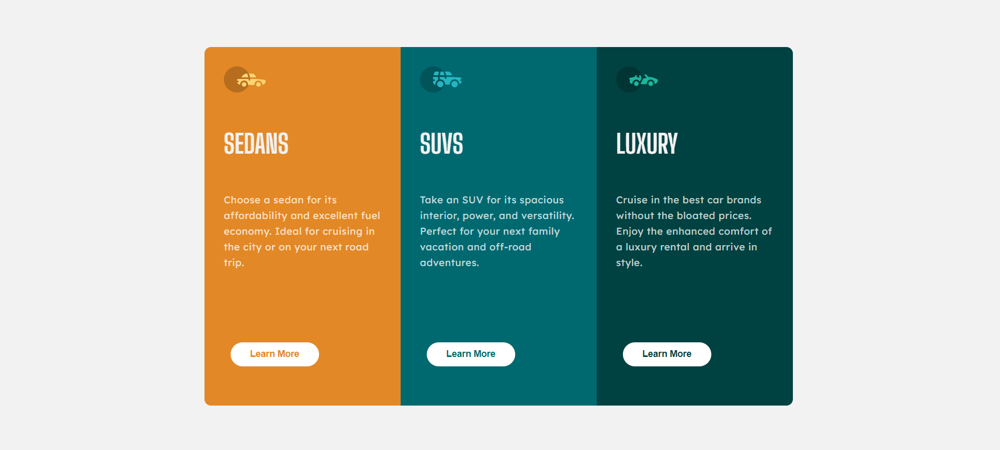

# Frontend Mentor - 3-column preview card component solution

This is a solution to the [3-column preview card component challenge on Frontend Mentor](https://www.frontendmentor.io/challenges/3column-preview-card-component-pH92eAR2-). Frontend Mentor challenges help you improve your coding skills by building realistic projects.

## Table of contents

- [Overview](#overview)
  - [The challenge](#the-challenge)
  - [Screenshot](#screenshot)
  - [Links](#links)
- [My process](#my-process)
  - [Built with](#built-with)
  - [What I learned](#what-i-learned)
  - [Continued development](#continued-development)
  - [Useful resources](#useful-resources)
- [Author](#author)
- [Acknowledgments](#acknowledgments)

## Overview

### The challenge

Users should be able to:

- View the optimal layout depending on their device's screen size
- See hover states for interactive elements

### Screenshot



### Links

- Solution URL:https://github.com/ElisaRumSolberg/3-column-preview-card-component
- Live Site URL: https://elisarumsolberg.github.io/3-column-preview-card-component/


## My process

### Built with

- Semantic HTML5 markup
- CSS custom properties
- Flexbox
- CSS Grid
- Mobile-first workflow

### What I learned

While working on this project, I learned more about how to effectively use **Flexbox** and **CSS Grid** for responsive layouts. Here is an example of a snippet that helped me create a responsive layout:

```css
.container {
  display: flex;
  flex-direction: column;
}

@media (min-width: 768px) {
  .container {
    flex-direction: row;
  }
}
```

Additionally, I practiced creating **hover states** for interactive elements, ensuring that buttons change appearance when hovered over:

```css
.button:hover {
  background-color: hsl(228, 45%, 44%);
}
```

### Continued development

In future projects, I want to continue focusing on responsive design, especially when it comes to refining how layouts adjust to different screen sizes. I also plan to explore more complex **CSS animations** and **transitions** to enhance user interactions.

### Useful resources

- [CSS Tricks - A Complete Guide to Flexbox](https://css-tricks.com/snippets/css/a-guide-to-flexbox/) - This guide helped me understand how Flexbox works and how to structure my layout.
- [MDN Web Docs - Responsive Design](https://developer.mozilla.org/en-US/docs/Learn/CSS/CSS_layout/Responsive_Design) - This article gave me a better understanding of how to implement responsive design techniques.

## Author

- Frontend Mentor -https://www.frontendmentor.io/profile/ElisaRumSolberg
  


